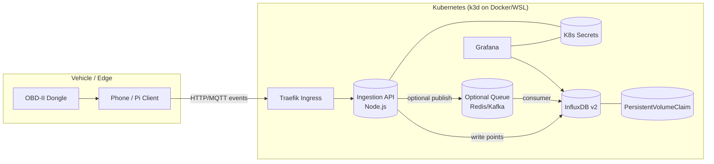
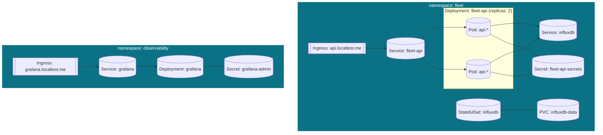
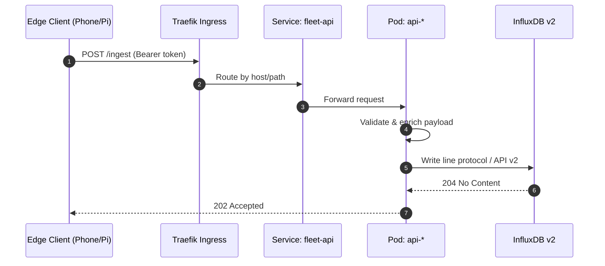
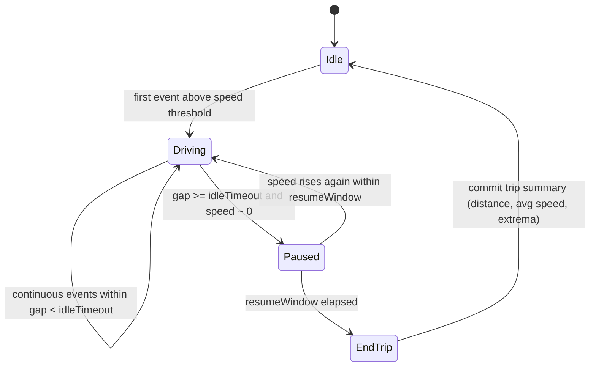
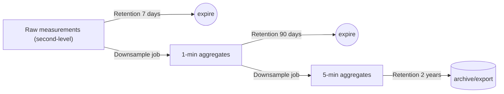

# Fleet Telemetry Architecture

This document provides a visual and conceptual overview of the Fleet Telemetry project – a self-hosted stack for ingesting, storing, and visualizing car telemetry data.

---

## 1. System Overview

---

## 2. Kubernetes Deployment View

---

## 3. Ingestion Request Lifecycle

---

## 4. Trip Segmentation State Machine

---

## 5. Data Lifecycle and Retention

---

### Notes

* The architecture is modular. Each component (API, storage, dashboard) can be replaced or scaled independently.
* All services run inside Kubernetes namespaces (`fleet`, `observability`).
* Default Ingress: Traefik (provided by k3d).
* Default storage: InfluxDB v2 with PVC-based persistence.
* Optional components: Redis/Kafka for buffering, ArgoCD for GitOps, cert-manager for TLS.

---

### Next Steps

* Decide on the data ingestion strategy (HTTP-only, MQTT, or hybrid).
* Define telemetry schema (essential fields and optional sensors).
* Outline trip logic: idle thresholds, segmenting rules.
* Select the first dashboard metrics to visualize.
* Build incrementally; validate each module (API, DB, Grafana) before scaling up.
